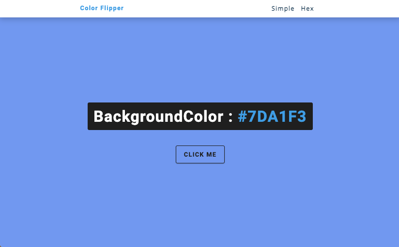
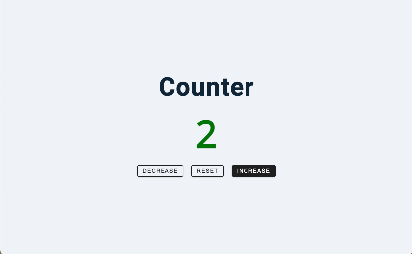
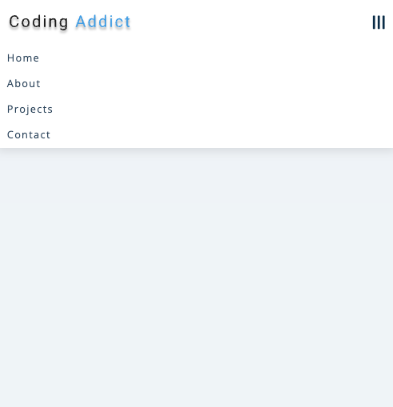
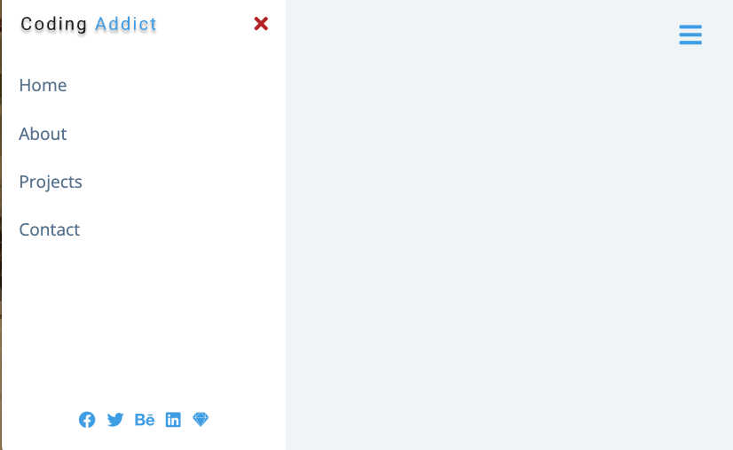

# JS-MiniProject
자바스크립 공부를 위한 미니프로젝트

## 1. ColorFilpper

- DOM
- document.getElementById()
- document.querySelector()
- addEventListener()
- document.body.style.backgroundColor
- Math.floor()
- Math.random()
- array.length

## 2. Counter
- document.querySelectorAll()
- forEach()
- addEventListener()
- currentTarget 속성
- [classList](https://seokzin.tistory.com/entry/Javascript-classList-%EB%A9%94%EC%84%9C%EB%93%9C-%EC%A2%85%EB%A5%98-remove-add-item-toggle-contains-replace)
- textContent

## 3. Reviews ❔
- 객체
- [DOMContentLoaded](https://sirius7.tistory.com/33)
- addEventListener()
- array.length
- textContent

## 4. Navbar(반응형)
- document.querySelector()
- addEventListener()
- classList.toggle()

## 5. Sidebar
- document.querySelector()
- addEventListener()
- classList.toggle()
- classList.remove()

## 6. Modal
- document.querySelector()
- addEventListener()
- classList.toggle()
- classList.remove()

---
## 참고자료
- [이 자료를 이용하여 공부함](https://freecodecamp.org/korean/news/javascript-projects-for-beginners/#counter)
